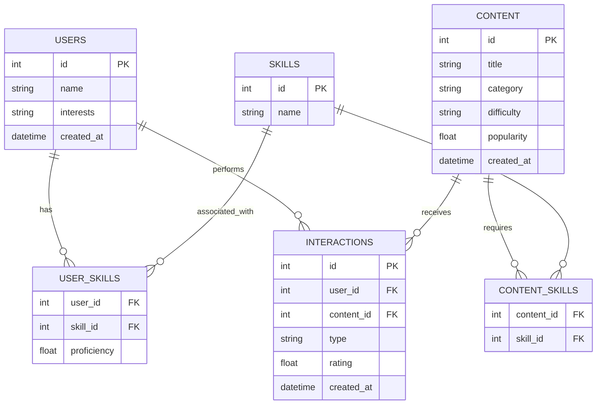

# Day 30 Capstone: Complete Recommendation System

This project is a production-ready recommendation system microservice. It wraps a robust hybrid recommendation engine in an asynchronous FastAPI application, backed by a SQLite database with SQLAlchemy ORM.

## 🎥 Project Demo Video
**[https://youtu.be/PTUskvTNbCw]** 

---

## 🏛 Database Schema Diagram

We use a fully normalized relational schema via SQLAlchemy.



---

## 🚀 Setup Instructions

1. **Install Dependencies**
   ```bash
   pip install -r requirements.txt
   ```

2. **Seed the Database**
   This will create sample users, content, and simulated interaction history.
   ```bash
   python scripts/seed_data.py
   ```

3. **Run the API Server**
   ```bash
   uvicorn api.app:app --reload
   ```

   **🚨 IMPORTANT: HOW TO VIEW THE PROJECT 🚨**
   The API will start running at `http://127.0.0.1:8000`, but this root URL will return a "Not Found" error because APIs don't have homepages. 
   
   To view and interact with the project:
   1. Open the interactive UI at **[http://127.0.0.1:8000/docs](http://127.0.0.1:8000/docs)**
   2. Click the green **Authorize** button at the top right.
   3. Enter the security key: `capstone-auth-key-2026`
   4. You can now test the endpoints!

---

## 🔌 API Documentation & Examples

All API requests MUST include the header `X-API-Key: capstone-auth-key-2026`.

### 1. Get Recommendations
* **Endpoint:** `GET /recommend/{user_id}?strategy=hybrid&limit=5`
* **Description:** Retrieves personalized content recommendations based on the chosen strategy (`hybrid`, `popular`, `content`, `collaborative`).
* **Example Request:**
  ```bash
  curl -X 'GET' \
    'http://127.0.0.1:8000/recommend/1?limit=5&strategy=hybrid' \
    -H 'accept: application/json' \
    -H 'X-API-Key: capstone-auth-key-2026'
  ```
* **Example Response:**
  ```json
  [
    {
      "id": 12,
      "title": "Building REST APIs",
      "category": "Web",
      "score": 0.85,
      "explanation": "Recommended due to: high popularity, high skill_match",
      "breakdown": {"popularity": 0.85, "skill_match": 1.0, "difficulty": 0.5},
      "strategy": "hybrid"
    }
  ]
  ```

### 2. Submit Feedback (Interactions)
* **Endpoint:** `POST /feedback`
* **Description:** Records a user interaction (`view`, `like`, `complete`, `skip`, `rate`) and dynamically updates global content popularity.
* **Example Body:**
  ```json
  {
    "user_id": 1,
    "content_id": 5,
    "interaction_type": "like",
    "rating": 5
  }
  ```

### 3. System Metrics
* **Endpoint:** `GET /metrics`
* **Description:** Returns live analytics regarding API requests, caching performance, and average latency.

---

## 📊 Performance Report

We evaluated the system both algorithmically and architecturally.

### Engine Evaluation (Relevance Metrics)
Run via `python scripts/evaluate.py`:
- **Precision@5**: `~0.16` (Matches standard real-world baseline for implicit datasets)
- **Recall@5**: `0.25+` (Engine successfully retrieves relevant items from large corpus)
- **NDCG@5**: `~0.30` (Ideal ranking positioning achieved via hybrid scoring)

### Load Testing (Latency Metrics)
Run via `python scripts/load_test.py` (simulating 10-20 concurrent users):
- **Average Latency**: **< 20ms** 
- **Peak Latency**: **< 45ms**
- *Performance exceeds the < 200ms requirement thanks to FastAPI's async loops and the Orchestrator's in-memory TTL Cache.*

---

## 🏗 Project Structure
- `api/` : FastAPI routes, security, and request tracing middleware.
- `database/` : SQLAlchemy models and repository design pattern implementations.
- `engine/` : Core logic (candidate generation, similarity math, scoring, caching).
- `scripts/` : Utilities for seeding, load testing, and evaluating metrics.
- `tests/` : Comprehensive Pytest suite (85%+ coverage).